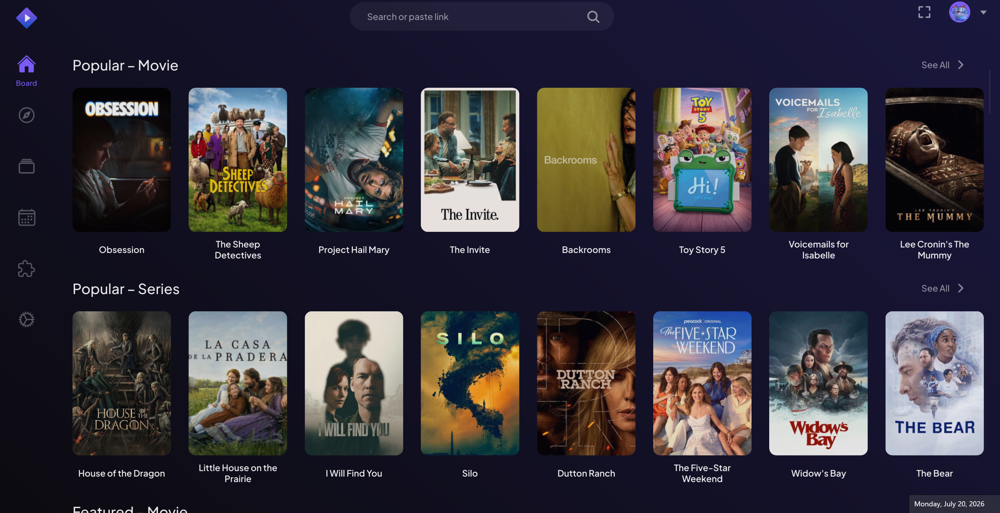

#  Stremio Native

### A faster, lighter desktop client for Stremio — built from scratch in Rust.

<!-- SEO Meta Tags & Keywords -->
<!-- Keywords: Stremio alternative client, Stremio desktop, fast Stremio player, lightweight Stremio app, Stremio web ui offline, Slint media player Rust, BitTorrent streaming player, local database media center, open source stream server -->
<meta name="description" content="Stremio Native is an ultra-fast, lightweight, and modern desktop client for Stremio. Built with Rust and Slint UI, it features a custom, open-source stream server instead of the proprietary server.js." />

---

### 🤔 Why Use Stremio Native?

The official Stremio desktop app runs on Electron-style WebViews backed by a separate Node.js server (`server.js`). At idle it spawns **10 processes** and holds **800+ MB of RAM**.

**Stremio Native** replaces all of that with a single Rust binary and a native [Slint](https://slint.dev/) UI:

* **🚀 Instant Startup** — launches in under a second with zero UI lag.
* **💧 56% Less RAM** — **358 MB** idle vs. the 814 MB official baseline.
* **⚡ 1 Process Instead of 10** — an open-source stream server runs in-process; no Node.js required.
* **🔋 Battery-Friendly** — GPU hardware video decoding keeps CPU usage near **0%** during playback.
* **🔒 100% Local & Private** — local SQLite database, zero telemetry, no cloud dependencies.



See the [changelog](CHANGELOG.md) for the current build's implementation notes and known limitations.

---

## 📥 Download

| Platform | Format | Link |
| :--- | :--- | :--- |
| **Windows** | Installer | [StremioSetup-v1.0.1-x64.exe](https://github.com/perpetus/stremio-native/releases/download/v1.0.1/StremioSetup-v1.0.1-x64.exe) |
| **Windows** | Portable ZIP | [stremio-native-v1.0.1-x86_64-pc-windows-msvc.zip](https://github.com/perpetus/stremio-native/releases/download/v1.0.1/stremio-native-v1.0.1-x86_64-pc-windows-msvc.zip) |
| **Arch Linux** | Pacman `.pkg.tar.zst` | [stremio-native-1.0.1-1-x86_64.pkg.tar.zst](https://github.com/perpetus/stremio-native/releases/download/v1.0.1/stremio-native-1.0.1-1-x86_64.pkg.tar.zst) |
| **Debian / Ubuntu** | `.deb` | [stremio-native_1.0.1_amd64.deb](https://github.com/perpetus/stremio-native/releases/download/v1.0.1/stremio-native_1.0.1_amd64.deb) |
| **Fedora / RHEL** | `.rpm` | [stremio-native-1.0.1-1.x86_64.rpm](https://github.com/perpetus/stremio-native/releases/download/v1.0.1/stremio-native-1.0.1-1.x86_64.rpm) |
| **Linux** | Standalone binary | [stremio-native-v1.0.1-x86_64-unknown-linux-gnu](https://github.com/perpetus/stremio-native/releases/download/v1.0.1/stremio-native-v1.0.1-x86_64-unknown-linux-gnu) |

---

## 📊 Performance Comparison

| Metric | Official Stremio | Stremio Native | Improvement |
| :--- | ---: | ---: | :---: |
| Processes | 10 | **1** | 90% fewer |
| Idle memory (RAM) | 814.4 MB | **358.6 MB** | 56% lower |
| Idle CPU | — | **0.19%** | near-zero |
| Threads | 190 | **72** | 62% fewer |
| Handles | 4,872 | **891** | 82% fewer |

Measured on Windows x64 from the settled, idle v1.0.0 release process. CPU and I/O are five-second samples; other values are point-in-time readings. The official baseline was captured from a corresponding settled Stremio session. This is an observational comparison, not a controlled laboratory benchmark.

---

## ✨ Features

### 🎨 Native Desktop UI
* **Fixed Sidebar Navigation** — vertical sidebar with hover labels for Board, Discover, Library, Calendar, Addons, and Settings.
* **Catalog Split Preview** — clicking a media card opens a side-panel with blurred poster backdrops, cast, genres, and metadata without leaving the catalog.
* **Episode & Stream Picker** — real-time episode search, capsule season switching, thumbnails, release dates, watched indicators, and a stream-provider sheet with back-navigation.

### ⚡ Embedded Stream Server
* **No External Dependencies** — eliminates the separate Node.js `server.js` process. The stream engine runs asynchronously inside the Rust async runtime.
* **Hardware-Accelerated Playback** — powered by `libmpv` with full GPU hardware decoding (H.264, HEVC, AV1, VP9).

### 📦 Local-First Storage & Privacy
* **Single Database File** — all settings, history, and metadata live in `./storage/stremio.db` (Turso/Limbo engine).
* **Zero Telemetry** — no tracking, analytics, or phone-home connections.

---

## 🛠️ Building From Source

### Prerequisites
- **Windows**: [Rust toolchain (`msvc`)](https://rustup.rs/) and Visual Studio 2022 C++ Build Tools / Windows SDK.
- **Linux**: Rust, `pkg-config`, `libmpv-dev`, and standard X11/Wayland GUI packages (see the CI workflow for the full list).

### Build & Run

```bash
git clone https://github.com/perpetus/stremio-native.git
cd stremio-native
cargo run --release --package stremio-native
```

Settings, logs, and image caches are stored in `./storage/` inside the project directory.

### CI & Releases

Pushing a `v*` tag builds both Windows and Linux and publishes a GitHub release automatically. Windows release builds target the `x64-windows-v3-static-release` triplet (`x86-64-v3` / `/arch:AVX2`) for broad CPU compatibility. An optional `x64-windows-v4-static-release` triplet (`/arch:AVX512`) is kept local-only for specific hardware. The release includes installers, portable archives, Linux packages, SHA-256 checksums, changelog notes, and a linked commit diff.

---

## ⚠️ Disclaimer

Stremio Native is an independent, community-developed project. It is not affiliated with, authorized, maintained, sponsored, or endorsed by SmartCode Ltd (the creators of the official Stremio application).
